# Dynamic Satellite Network Testbed with QKD and SDN


A proof-of-concept testbed for a **dynamic satellite network** that integrates **Quantum Key Distribution (QKD)** with **Software-Defined Networking (SDN)** using **Mininet** (emulation) and **Ryu** (controller).

---

## Table of Contents
- [Overview](#overview)
- [Architecture](#architecture)
- [Components](#components)
- [Quick Start](#quick-start)
  - [Option A: Vagrant (recommended)](#option-a-vagrant-recommended)
  - [Option B: Manual Setup](#option-b-manual-setup)
- [Run the Demo](#run-the-demo)
- [Repository Structure](#repository-structure)
- [MATLAB Data Generation](#matlab-data-generation)
- [Troubleshooting](#troubleshooting)
- [Contributing](#contributing)
- [License](#license)

---

## Overview
- **Mininet** emulates a dynamic topology of one satellite (SAT 1) and two Optical Ground Stations (OGS 1 & OGS 2). Links go **UP/DOWN** over time according to access intervals.
- A **Ryu SDN Controller** manages IP/ARP traffic and a custom EtherType (**0x88B5**) for QKD key requests/replies.
- A **QKD simulation** app generates keys and **pushes them to the controller** over TCP (127.0.0.1:7001) for distribution.

Topology (logical):
```
OGS 1 (h_s2) ---- SAT 1 (h_s1) ---- OGS 2 (h_s3)
```

---

## Architecture

```mermaid




 
 flowchart LR
    %% Styles
    classDef ground  fill:#f0fff4,stroke:#2f855a,stroke-width:1px,rx:6,ry:6;
    classDef sat     fill:#ebf8ff,stroke:#3182ce,stroke-width:1px,rx:6,ry:6;
    classDef ctrl    fill:#f7fafc,stroke:#2b6cb0,stroke-width:1px,rx:6,ry:6;
    classDef process fill:#fffaf0,stroke:#dd6b20,stroke-width:1px,rx:6,ry:6;

    %% Emulation plane
    subgraph Emulation [Mininet Emulation]
      direction LR
      OGS1["📡 OGS 1 (h_s2)"]:::ground
      SAT1["🛰️ SAT 1 (h_s1)"]:::sat
      OGS2["📡 OGS 2 (h_s3)"]:::ground
    end

    %% Control / apps
    RYU["🧠 Ryu SDN Controller"]:::ctrl
    QKD["🔐 QKD_sdn.py (Key Generation)"]:::process

    %% Physical/data-plane topology
    OGS1 --- SAT1 --- OGS2

    %% Control/QKD flows (dashed)
    OGS1 -.->|QKD Req 0x88B5| RYU
    RYU  -.->|Key Reply| OGS1
    QKD  -.->|Push Key TCP:7001| RYU

    %% Key forwarding via SAT 1 (dashed to overlay on topology)
    OGS1 -.->|Key UDP:6000| SAT1
    SAT1 -.-> OGS2 







```



---

## Components
- **`dynamic_sat_net.py`** — Builds the Mininet topology using CSV inputs and toggles links according to access intervals.
- **`mininet_nodes.csv`** — Lists nodes (e.g., `SAT 1`, `OGS 1`, `OGS 2`).
- **`mininet_access_intervals.csv`** — Time intervals when links are active.
- **`SDNcontroller.py`** — Ryu controller handling IP/ARP and custom QKD EtherType **0x88B5**; listens on **127.0.0.1:7001** to receive/store keys.
- **`QKD_sdn.py`** — Simulates QKD and pushes the generated key to the controller via TCP.
- **`ogs1_client.py`** — Runs on OGS 1; sends broadcast key request and forwards received key to OGS 2 over UDP.
- **`ogs2_client.py`** — Runs on OGS 2; listens on UDP **6000** for the key.

---

## Quick Start

### Option A: Vagrant (recommended)
The provided Vagrant definition spins up an Ubuntu 20.04 VM, installs **Mininet**, **Ryu**, **Python 3**, and **QuNetSim**.

> **Ports forwarded**: 6633 (OpenFlow), 8080 (optional web UIs).

```bash
# In the project root (where Vagrantfile is located)
vagrant up
vagrant ssh
```

Once inside the VM:
```bash
# (If not already installed by provisioning) create & activate venv for Python tools
python3 -m venv venv
source ./venv/bin/activate
pip install --upgrade pip

# (If you plan to use QuNetSim locally)
# Either via SSH (requires GitHub SSH keys):
# git clone git@github.com:tqsd/QuNetSim.git
# Or via HTTPS:
# git clone https://github.com/tqsd/QuNetSim.git

# Install QuNetSim requirements
pip install -r ./QuNetSim/requirements.txt
export PYTHONPATH="$PYTHONPATH:$(pwd)/QuNetSim"
```

### Option B: Manual Setup
If you prefer to run directly on your host machine (Linux recommended):
```bash
# System packages (example)
sudo apt-get update -y
sudo apt-get install -y python3 python3-pip python3-venv git

# Mininet (choose your method / version)
# See: https://github.com/mininet/mininet
# Example quick install (all features):
git clone https://github.com/mininet/mininet
cd mininet && git checkout -b mininet-2.3.0 2.3.0 && cd ..
sudo mininet/util/install.sh -a

# Ryu controller
# See: https://github.com/faucetsdn/ryu
git clone https://github.com/faucetsdn/ryu.git
cd ryu && pip install . && cd ..

# Python venv & QuNetSim deps
python3 -m venv venv
source ./venv/bin/activate
pip install --upgrade pip
pip install -r ./QuNetSim/requirements.txt
export PYTHONPATH="$PYTHONPATH:$(pwd)/QuNetSim"
```

> **Tip:** If you already have `mininet_nodes.csv` and `mininet_access_intervals.csv`, MATLAB is not required to run the demo.

---

## Run the Demo
Open **three terminals** (or panes). In each terminal, activate your Python venv if you created one.

### 1) Start the Ryu Controller
```bash
ryu-manager SDNcontroller.py
```
You should see logs indicating the controller is running and listening on **127.0.0.1:7001** for QKD keys.

### 2) Launch the Mininet Topology
```bash
sudo python3 dynamic_sat_net.py
```
This builds the network and starts dynamic link toggling based on `mininet_access_intervals.csv`. You’ll drop into the Mininet CLI.

From the Mininet CLI:
```bash
dump              # list hosts/switches (note h_s2, h_s3, etc.)
xterm h_s2 h_s3   # open host terminals for OGS1 and OGS2
```

### 3) Generate and Distribute a QKD Key
In a **new terminal** (outside Mininet), run:
```bash
python3 QKD_sdn.py
```
The controller terminal should acknowledge key reception.

### 4) Request & Forward the Key Inside Mininet
- In the **OGS2** xterm:
  ```bash
  python3 ogs2_client.py
  ```
- In the **OGS1** xterm (replace `<OGS2_IP>` with OGS2’s IP from `dump`, e.g., `10.0.0.3`):
  ```bash
  python3 ogs1_client.py h_s2-eth0 <OGS2_IP> OGS1 OGS2 16
  ```

**Expected outcome:**
- Ryu logs switch connections and QKD key ingestion.
- `ogs2_client.py` prints that it **received the key** (with length).

---

## Repository Structure
```
├── dynamic_sat_net.py
├── SDNcontroller.py
├── QKD_sdn.py
├── ogs1_client.py
├── ogs2_client.py
├── mininet_nodes.csv
├── mininet_access_intervals.csv
├── Vagrantfile
└── MATLAB/
    ├── SimulateScenario.m
    └── ExportDataToCSV.m
```

---

## MATLAB Data Generation
Two MATLAB scripts produce the CSVs consumed by `dynamic_sat_net.py`:
- **`SimulateScenario.m`** — runs the scenario and determines satellite–ground access windows.
- **`ExportDataToCSV.m`** — exports **`mininet_nodes.csv`** and **`mininet_access_intervals.csv`**.

If you prefer not to run MATLAB, use the pre-generated CSV files included in the repo (if present).

---

## Troubleshooting
- **Ryu not reachable from Mininet**: ensure the controller IP/port match Mininet’s remote controller settings (default OpenFlow port **6633**). If running on the host, verify firewall/NAT rules.
- **QuNetSim import errors**: confirm `PYTHONPATH` includes the path to your `QuNetSim` folder and that `pip install -r ./QuNetSim/requirements.txt` completed successfully.
- **Vagrant SSH clone fails**: if provisioning uses `git@github.com:...`, you need GitHub SSH keys configured. Use the HTTPS URL as an alternative.
- **Permission denied**: `mininet` commands require `sudo`.

---

## Contributing
Issues and pull requests are welcome. Please open an issue describing the change or bug before submitting a PR.

---

## License
**TBD.** 

